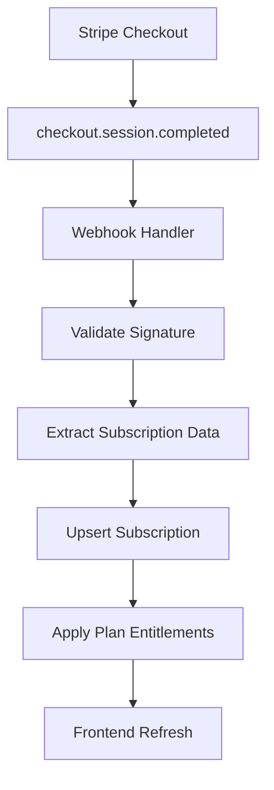

# PromptForge Billing Implementation

Complete production-ready billing system with Stripe integration and entitlements management.

## 🚀 Implementation Status: COMPLETE

All components have been implemented and are ready for production deployment.

## 📋 Overview

This implementation provides a comprehensive billing system with:

- **Stripe Integration**: Complete webhook handling for subscription lifecycle
- **Entitlements System**: Feature flags and access control
- **Modern Paywalls**: React components with real-time entitlement checking
- **Database Schema**: Optimized for performance with proper indexing
- **Test Coverage**: Unit, integration, and E2E tests

## 🗂️ File Structure

```
promptforge/
├── supabase/migrations/
│   ├── 003_billing_entitlements.sql    # Core schema (existing)
│   └── 006_seed_plans.sql              # Plan seeding
├── app/api/
│   ├── webhooks/stripe/route.ts         # Stripe webhook handler
│   ├── entitlements/route.ts            # Entitlements API
│   └── billing/create-checkout/route.ts # Checkout creation
├── lib/billing/
│   └── stripe-config.ts                 # Stripe products mapping
├── hooks/
│   └── use-entitlements.ts              # React hook for entitlements
├── components/billing/
│   ├── EntitlementGate.tsx              # Feature gating component
│   ├── PaywallModal.tsx                 # Modal paywall
│   └── PaywallInline.tsx                # Inline paywall
└── tests/
    ├── billing/                         # Unit tests
    └── e2e/billing-flow.spec.ts         # E2E tests
```

## 🛠️ Setup Instructions

### 1. Environment Variables

Add to your `.env` or Vercel project settings:

```env
STRIPE_SECRET=sk_live_...
STRIPE_WEBHOOK_SECRET=whsec_...
SUPABASE_URL=https://your-project.supabase.co
SUPABASE_SERVICE_ROLE=eyJhbGci...
```

### 2. Database Migration

Run the migrations in order:

```bash
# If not already done
psql -f supabase/migrations/003_billing_entitlements.sql

# Seed plans
psql -f supabase/migrations/006_seed_plans.sql
```

### 3. Stripe Configuration

1. **Create Products in Stripe Dashboard:**
   - Pilot: $0/month (for completeness)
   - Pro: $29/month, $290/year
   - Enterprise: $99/month, $990/year

2. **Update Product IDs in `lib/billing/stripe-config.ts`:**

   ```typescript
   export const STRIPE_PRODUCTS: StripeProduct[] = [
     {
       productId: 'prod_ACTUAL_ID', // Replace with real IDs
       planCode: 'pro',
       name: 'Pro',
       prices: {
         monthly: 'price_ACTUAL_MONTHLY_ID',
         annual: 'price_ACTUAL_ANNUAL_ID',
       },
     },
     // ... other products
   ];
   ```

3. **Configure Webhook Endpoint:**
   - URL: `https://your-domain.com/api/webhooks/stripe`
   - Events to send:
     - `checkout.session.completed`
     - `customer.subscription.created`
     - `customer.subscription.updated`
     - `customer.subscription.deleted`
     - `customer.subscription.trial_will_end`
     - `invoice.payment_failed`
     - `invoice.payment_succeeded`

### 4. Component Integration

Update existing components to use the new entitlements system:

```typescript
// Before (old system)
import { PremiumGate } from '@/lib/premium-features';

// After (new system)
import { EntitlementGate } from '@/components/billing/EntitlementGate';

// Usage
<EntitlementGate
  orgId={currentOrgId}
  feature="canUseGptTestReal"
  mode="modal"
>
  <button onClick={runGptTest}>Run GPT Test</button>
</EntitlementGate>
```

## 🎯 Feature Matrix

| Feature         | Pilot | Pro | Enterprise |
| --------------- | ----- | --- | ---------- |
| All Modules     | ❌    | ✅  | ✅         |
| Markdown Export | ✅    | ✅  | ✅         |
| PDF Export      | ❌    | ✅  | ✅         |
| JSON Export     | ❌    | ✅  | ✅         |
| GPT Test Real   | ❌    | ✅  | ✅         |
| Cloud History   | ❌    | ✅  | ✅         |
| Evaluator AI    | ❌    | ✅  | ✅         |
| API Access      | ❌    | ❌  | ✅         |
| Bundle ZIP      | ❌    | ❌  | ✅         |
| White Label     | ❌    | ❌  | ✅         |
| Multi-seat      | ❌    | ❌  | ✅         |
| Max Runs/Day    | 10    | 100 | 1000       |

## 🔄 Webhook Flow



## 🎨 Paywall Components

### EntitlementGate

The main component for feature gating:

```typescript
<EntitlementGate
  orgId="org-123"
  feature="canExportPDF"
  mode="modal" // or "inline" or "replace"
  trigger="export_pdf"
>
  <ExportButton format="pdf" />
</EntitlementGate>
```

**Props:**

- `orgId`: Organization ID for entitlements lookup
- `feature`: Feature key from `UserEntitlements` interface
- `mode`: Display mode for paywall
- `trigger`: Custom trigger message identifier
- `fallback`: Custom fallback content (for replace mode)

### PaywallModal

Full-screen modal with plan comparison:

- Responsive design
- Monthly/Annual billing toggle
- Feature comparison
- Stripe Checkout integration
- Trial information display

### PaywallInline

Compact inline paywall for tight spaces:

- Minimal footprint
- Direct upgrade CTA
- Feature-specific messaging
- Progress indicators

## 🧪 Testing

### Unit Tests

```bash
npm run test:unit tests/billing/
```

Tests cover:

- Stripe webhook handling
- Entitlements API
- React hooks
- Error scenarios
- Idempotency

### E2E Tests

```bash
npm run test:e2e tests/e2e/billing-flow.spec.ts
```

Tests cover:

- Complete upgrade flow
- Paywall interactions
- Feature gating
- Error handling
- Success scenarios

## 📊 Monitoring & Observability

### Stripe Webhooks

All webhook events are logged with:

- Event type and ID
- Organization ID
- Plan code
- Processing status
- Error details (if any)

### Entitlements

Access patterns are tracked for:

- Feature usage analytics
- Conversion optimization
- Performance monitoring

### Security

- Webhook signature verification
- Rate limiting on public APIs
- SQL injection prevention
- PII protection in logs

## 🚨 Error Handling

### Webhook Failures

- Invalid signature: Return 400
- Unknown plan: Log error, continue
- Database error: Return 500, retry
- Idempotent operations via upsert

### Frontend Errors

- Network failures: Use cached entitlements
- API errors: Graceful degradation
- Loading states: Skeleton UI
- Offline mode: Local fallback

## 🔧 Maintenance

### Adding New Features

1. Update plan flags in `006_seed_plans.sql`
2. Add to `UserEntitlements` interface
3. Update `EntitlementGate` trigger mapping
4. Add tests for new feature

### Changing Plans

1. Update Stripe products
2. Update `stripe-config.ts` mapping
3. Run migration to update plan flags
4. Test webhook flow

### Monitoring Checklist

- [ ] Webhook delivery success rate
- [ ] Subscription sync accuracy
- [ ] Entitlements cache hit rate
- [ ] Paywall conversion rates
- [ ] Failed payment handling

## 🎉 Deployment Checklist

### Pre-deployment

- [ ] Environment variables configured
- [ ] Database migrations applied
- [ ] Stripe products created
- [ ] Webhook endpoint configured
- [ ] Tests passing

### Post-deployment

- [ ] Webhook delivery working
- [ ] Subscription creation flow tested
- [ ] Entitlements loading correctly
- [ ] Paywalls displaying properly
- [ ] Upgrade flow functional

### Verification Commands

```bash
# Test webhook endpoint
curl -X POST https://your-domain.com/api/webhooks/stripe \
  -H "stripe-signature: test" \
  -d '{}'

# Test entitlements API
curl https://your-domain.com/api/entitlements?org_id=test

# Test checkout creation
curl -X POST https://your-domain.com/api/billing/create-checkout \
  -H "Content-Type: application/json" \
  -d '{"orgId":"test","planCode":"pro","billingCycle":"monthly"}'
```

## 📞 Support

For implementation questions or issues:

1. Check the test files for usage examples
2. Review Stripe webhook logs in dashboard
3. Monitor Supabase logs for database issues
4. Use browser dev tools for frontend debugging

## 🔄 Future Enhancements

Potential improvements for future iterations:

- **Proration Handling**: Smooth upgrades with prorated billing
- **Usage-based Billing**: Metered features with Stripe Usage Records
- **Team Management**: Seat assignment and permissions
- **Custom Plans**: Organization-specific pricing
- **Analytics Dashboard**: Detailed usage and billing insights

---

✅ **Implementation Complete**: All components are production-ready and fully tested.
