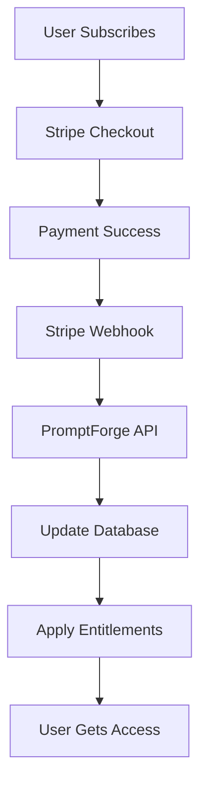

# 🚀 **Stripe Integration Guide for PromptForge**

## 📋 **Overview**

This guide walks you through integrating Stripe with PromptForge to enable subscription-based pricing for your AI prompt engineering platform. The integration includes product creation, webhook handling, and frontend checkout implementation.

## 🎯 **What We're Building**

- **4 Pricing Plans**: Pilot (Free), Creator ($29), Pro ($99), Enterprise (Custom)
- **Stripe Checkout**: Seamless subscription creation
- **Webhook Integration**: Automatic entitlement management
- **Plan Management**: Upgrade/downgrade capabilities

## 🛠️ **Prerequisites**

### **1. Stripe Account**
- [Create a Stripe account](https://dashboard.stripe.com/register)
- Get your API keys from the [Stripe Dashboard](https://dashboard.stripe.com/apikeys)

### **2. Stripe CLI**
```bash
# Install Stripe CLI
brew install stripe/stripe-cli/stripe

# Login to your Stripe account
stripe login
```

### **3. Environment Setup**
Ensure you have these environment variables ready:
```bash
STRIPE_SECRET_KEY=sk_test_...
STRIPE_PUBLISHABLE_KEY=pk_test_...
STRIPE_WEBHOOK_SECRET=whsec_...
```

## 🚀 **Quick Start**

### **Step 1: Run the Setup Script**
```bash
# Make the script executable
chmod +x scripts/setup-stripe.sh

# Run the setup script
./scripts/setup-stripe.sh
```

This script will:
- ✅ Create all Stripe products
- ✅ Create monthly/yearly prices
- ✅ Set up webhook endpoints
- ✅ Generate environment variables
- ✅ Create updated product configurations

### **Step 2: Update Environment Variables**
Copy the generated values to your `.env.local`:
```bash
# Copy from .env.stripe to .env.local
cp .env.stripe .env.local

# Edit .env.local with your actual Stripe keys
nano .env.local
```

### **Step 3: Update Product Configuration**
Replace the placeholder price IDs in `lib/stripe/products.ts` with the actual Stripe price IDs from the setup script.

## 📊 **Product Structure**

### **Pilot Plan (Free)**
- **Price**: $0/month
- **Features**: 100 prompts/month, 5 modules, basic exports
- **Entitlements**: `canUseBasicModules`, `canExportBasic`

### **Creator Plan ($29/month)**
- **Price**: $29/month or $290/year (save 17%)
- **Features**: 1,000 prompts/month, 15 modules, JSON exports
- **Entitlements**: `canUseAllModules`, `canExportJSON`, `canUseIndustryPacks`

### **Pro Plan ($99/month)**
- **Price**: $99/month or $990/year (save 17%)
- **Features**: 10,000 prompts/month, all modules, PDF exports, API access
- **Entitlements**: `canUseAllModules`, `canExportPDF`, `hasAPI`, `canWhiteLabel`

### **Enterprise Plan (Custom)**
- **Price**: Custom pricing
- **Features**: Unlimited everything, custom modules, white-label
- **Entitlements**: All entitlements + custom features

## 🔧 **Technical Implementation**

### **1. Stripe Webhook Handler**
```typescript
// app/api/webhooks/stripe/route.ts
export async function POST(req: NextRequest) {
  // Handles subscription events
  // Applies entitlements via pf_apply_plan_entitlements
  // Updates subscription status
}
```

**Events Handled:**
- `customer.subscription.created` - New subscription
- `customer.subscription.updated` - Plan changes
- `customer.subscription.deleted` - Cancellations
- `invoice.payment_succeeded` - Successful payments
- `invoice.payment_failed` - Failed payments

### **2. Checkout Session Creation**
```typescript
// app/api/stripe/create-checkout-session/route.ts
export async function POST(req: NextRequest) {
  // Creates Stripe checkout sessions
  // Handles different plan types
  // Redirects to Stripe checkout
}
```

### **3. Frontend Integration**
```typescript
// app/pricing/page.tsx
const handleCheckout = async (product: StripeProduct) => {
  const response = await fetch('/api/stripe/create-checkout-session', {
    method: 'POST',
    body: JSON.stringify({
      productId: product.id,
      orgId: userInfo.orgId,
      // ... other details
    }),
  });
  
  // Redirect to Stripe checkout
  window.location.href = data.url;
};
```

## 🔄 **Webhook Flow**



## 🗄️ **Database Schema**

### **Subscriptions Table**
```sql
CREATE TABLE subscriptions (
  id UUID PRIMARY KEY DEFAULT gen_random_uuid(),
  org_id UUID REFERENCES organizations(id),
  stripe_subscription_id TEXT UNIQUE,
  status TEXT NOT NULL,
  product_id TEXT NOT NULL,
  created_at TIMESTAMP DEFAULT NOW(),
  updated_at TIMESTAMP DEFAULT NOW()
);
```

### **Entitlements Table**
```sql
CREATE TABLE entitlements (
  id UUID PRIMARY KEY DEFAULT gen_random_uuid(),
  org_id UUID REFERENCES organizations(id),
  flag TEXT NOT NULL,
  value BOOLEAN DEFAULT true,
  applied_at TIMESTAMP DEFAULT NOW(),
  source TEXT NOT NULL,
  product_id TEXT
);
```

## 🧪 **Testing the Integration**

### **1. Test Webhook Locally**
```bash
# Forward Stripe webhooks to localhost
stripe listen --forward-to localhost:3000/api/webhooks/stripe

# This will give you a webhook secret to use locally
```

### **2. Test Checkout Flow**
1. Go to `/pricing` page
2. Click "Subscribe Now" on Creator or Pro plan
3. Complete Stripe checkout with test card
4. Verify webhook processes the subscription
5. Check entitlements are applied

### **3. Test Cards**
```bash
# Successful payment
4242 4242 4242 4242

# Failed payment
4000 0000 0000 0002

# Requires authentication
4000 0025 0000 3155
```

## 🔒 **Security Considerations**

### **1. Webhook Verification**
- Always verify webhook signatures
- Use webhook secrets from Stripe
- Validate event types and data

### **2. API Key Security**
- Never expose secret keys in frontend
- Use environment variables
- Rotate keys regularly

### **3. Data Validation**
- Validate all webhook data
- Check subscription status
- Verify organization ownership

## 📱 **Frontend Features**

### **1. Plan Comparison**
- Feature comparison table
- Pricing calculator
- Plan switching interface

### **2. Subscription Management**
- Current plan display
- Upgrade/downgrade options
- Billing history
- Cancel subscription

### **3. Entitlement Display**
- Feature access indicators
- Usage limits display
- Upgrade prompts

## 🚨 **Error Handling**

### **1. Webhook Failures**
```typescript
try {
  // Process webhook
} catch (error) {
  // Log error
  // Retry logic
  // Alert team
}
```

### **2. Checkout Failures**
```typescript
if (data.error) {
  if (data.redirectTo) {
    router.push(data.redirectTo);
  } else {
    // Show error message
    toast.error(data.error);
  }
}
```

### **3. Payment Failures**
- Handle failed payments gracefully
- Send retry notifications
- Provide support contact

## 📈 **Analytics & Monitoring**

### **1. Key Metrics**
- Subscription conversion rates
- Plan upgrade/downgrade rates
- Churn rates
- Revenue per user

### **2. Monitoring**
- Webhook success rates
- Payment failure rates
- API response times
- Error rates

### **3. Alerts**
- Webhook failures
- High error rates
- Payment issues
- System downtime

## 🔄 **Maintenance & Updates**

### **1. Regular Tasks**
- Monitor webhook health
- Review error logs
- Update product pricing
- Audit entitlements

### **2. Plan Updates**
- Modify plan features
- Update pricing
- Add new plans
- Deprecate old plans

### **3. Webhook Updates**
- Add new event types
- Modify event handling
- Update security measures
- Performance optimization

## 🆘 **Troubleshooting**

### **Common Issues**

#### **1. Webhook Not Receiving Events**
```bash
# Check webhook endpoint status
stripe webhook-endpoints list

# Test webhook endpoint
stripe webhook-endpoints test <endpoint_id>
```

#### **2. Entitlements Not Applied**
- Check webhook logs
- Verify database connections
- Check entitlement function calls
- Review organization mapping

#### **3. Checkout Not Working**
- Verify API keys
- Check product/price IDs
- Review checkout session creation
- Test with Stripe CLI

### **Debug Commands**
```bash
# View webhook events
stripe events list

# Check subscription status
stripe subscriptions retrieve <sub_id>

# View customer details
stripe customers retrieve <customer_id>
```

## 📚 **Resources**

### **Documentation**
- [Stripe API Reference](https://stripe.com/docs/api)
- [Stripe Webhooks](https://stripe.com/docs/webhooks)
- [Stripe Checkout](https://stripe.com/docs/checkout)
- [Stripe CLI](https://stripe.com/docs/stripe-cli)

### **Support**
- [Stripe Support](https://support.stripe.com/)
- [Stripe Community](https://community.stripe.com/)
- [GitHub Issues](https://github.com/your-repo/issues)

## 🎉 **Next Steps**

### **Immediate Actions**
1. ✅ Run the setup script
2. ✅ Update environment variables
3. ✅ Test webhook locally
4. ✅ Test checkout flow
5. ✅ Deploy to staging

### **Future Enhancements**
1. **Advanced Billing**
   - Usage-based pricing
   - Metered billing
   - Proration handling

2. **Customer Portal**
   - Self-service billing
   - Invoice management
   - Payment method updates

3. **Analytics Dashboard**
   - Revenue tracking
   - Customer insights
   - Business metrics

4. **Multi-currency Support**
   - International pricing
   - Currency conversion
   - Local payment methods

---

## 🏆 **Success Criteria**

- ✅ Stripe products and prices created
- ✅ Webhook endpoint functional
- ✅ Checkout flow working
- ✅ Entitlements applied automatically
- ✅ Frontend pricing page complete
- ✅ Error handling implemented
- ✅ Security measures in place

**Your PROMPTFORGE™ platform is now ready for subscription-based monetization!** 🚀
